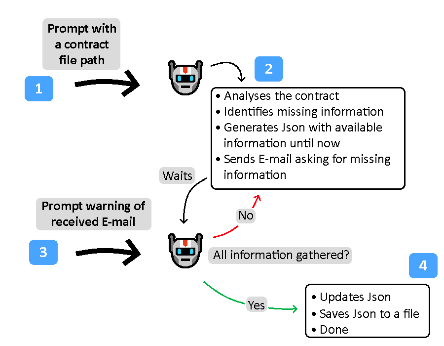

# An AI Agent built with LlammaIndex

This agent is a prototype for a research project done at UFRN, where the goal was to develop an agent that analyses contract information and exchanges e-mails with associated staff to complete any relevant missing information.

I experimented with implementing the agent on the [LlammaIndex](https://github.com/run-llama/llama_index) framework.

**WARNING**: This is not a finished product. The agent frequently fails to identify the correct missing information and or fails at some aspect of the workflow. Also, there is no safeguards when dealing with senstive information or attempts at _jail breaking_ the model.

Nontheless, it was an interesting prototype to develop and my first time making a AI agent of this complexity.

## How to run?

Besides a Python interpreter and the [LlammaIndex library](https://github.com/run-llama/llama_index), you must also have a vector database running while executing (verify/change the port at [embedding.py](https://github.com/CinquilCinquil/LlammaIndexContractAgent/blob/main/src/embedding.py)). I used docker with this [image](https://hub.docker.com/r/pgvector/pgvector).

With that, simply execute `main.py` with your python interpreter, as in: `python3 src/main.py`.